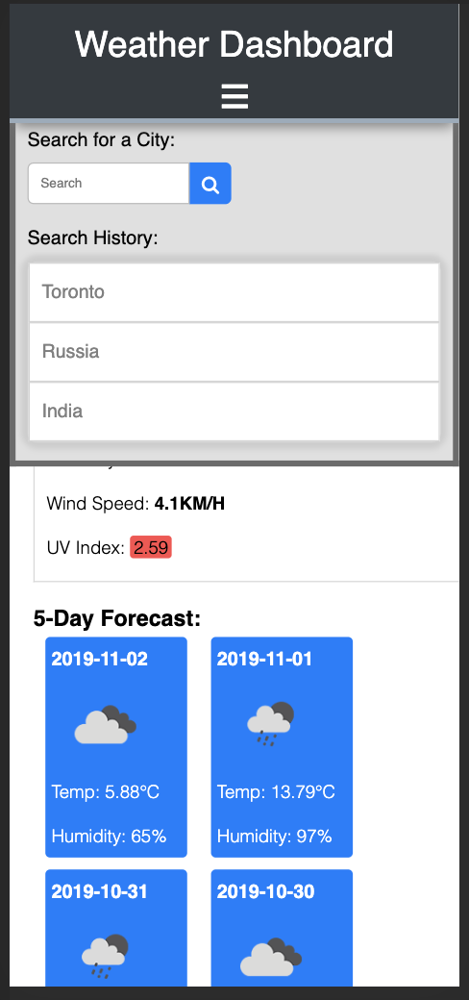

# weatherDashboard

Live Link: https://karanius.github.io/weatherDashboard/

 `https://openweathermap.org/`  offers a nice API to work with.
 I used it to create this weather dashboard.
 What I really enjoyed about this project was learning about Promises, and Async programming.

I really like the responsive side of this project where I tried to create the curtain effect - the Search Bar and Search History can be accessed through clicking on the heder. Also, I made sure to let the suer know if the search result is not found. This way the user does not get confused about the result of a failed search.

