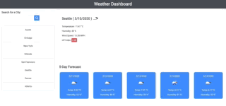

 `https://openweathermap.org/`  offers a nice API to work with.
 I used it to create this weather dashboard.
 What I really enjoyed about this project was learning about Promises, and Async programming.

I really like the responsive side of this project where I tried to create the curtain effect - the Search Bar and Search History can be accessed through clicking on the heder. Also, I made sure to let the suer know if the search result is not found. This way the user does not get confused about the result of a failed search.


# weather-dashboard
Weather dashboard application with search functionality to find current weather conditions and the future weather outlook for multiple cities.

# [LIVE LINK](https://karanius.github.io/UofT_Weather_Dashboard/)

## Table of Contents

- [weather-dashboard](#weather-dashboard)
- [LIVE LINK](#live-link)
  - [Table of Contents](#table-of-contents)
  - [About The Project](#about-the-project)
  - [User Stories](#user-stories)
  - [Development Strategy](#development-strategy)
  - [Demo](#demo)
  - [User Specifications](#user-specifications)
  - [Extra Futures/Spefications](#extra-futuresspefications)
  - [Tech Stack](#tech-stack)
  - [Licence](#licence)


## About The Project

Developers are often tasked with retrieving data from another application's API and using it in the context of their own. Third-party APIs allow developers to access their data and functionality by making requests with specific parameters to a URL. This project will include building a weather dashboard using the OpenWeather API and/or DarkSky API as per user's spefications.

## User Stories

```
As a traveler
I want to see the weather outlook for multiple cities
so that I can plan a trip accordingly
```

## Development Strategy

* Use the [OpenWeather API](https://openweathermap.org/api) and/or [DarkSky API](https://darksky.net/dev) to retrieve weather data for cities. The documentation includes a section called "How to start" that will provide basic setup and usage instructions.

* Use AJAX to hook into the API to retrieve data in JSON format.

* App should be able to run in the browser and feature dynamically updated HTML and CSS powered by jQuery.

* Display the following under current weather conditions:

  * City
  * Date
  * Icon image (visual representation of weather conditions)
  * Temperature
  * Humidity
  * Wind speed
  * UV index

* Include a search history so that users can access their past search terms. Clicking on the city name should perform a new search that returns current and future conditions for that city. 

* Include a 5-Day Forecast below the current weather conditions. Each day for the 5-Day Forecast should display the following:

  * Date
  * Icon image (visual representation of weather conditions)
  * Temperature
  * Humidity

## Demo


## User Specifications

- [x] Fully functional, deployed application.

- [x] GitHub repository with a unique name and a README describing the project.

- [x] User can search for weather reports by city using the openweathermap API.

- [x] After searching for a city, the following information is displayed:

  *  Current temperature
  *  Current humidity
  *  Windspeed
  *  Uv index
  *  5 day forecast

- [x] Application uses icons to represent weather conditions.

- [x] Application stores previously searched for cities in localstorage and displays them to the user.

- [x] Application loads last searched city forecast on page load.

## Extra Futures/Spefications

- [x] Use the [Geolocation API](https://developer.mozilla.org/en-US/docs/Web/API/Geolocation_API) to add the user's current location to the initial landing page.

- [x] Use [DarkSky API](https://darksky.net/dev) to get daily forecast

- [x] Use Materialize CSS for UI


## Tech Stack

1. HTML
2. CSS
3. AJAX
4. jQuery
5. JavaScript
6. API

## Licence

This project is licensed under the MIT License - see the LICENSE.md file for details
